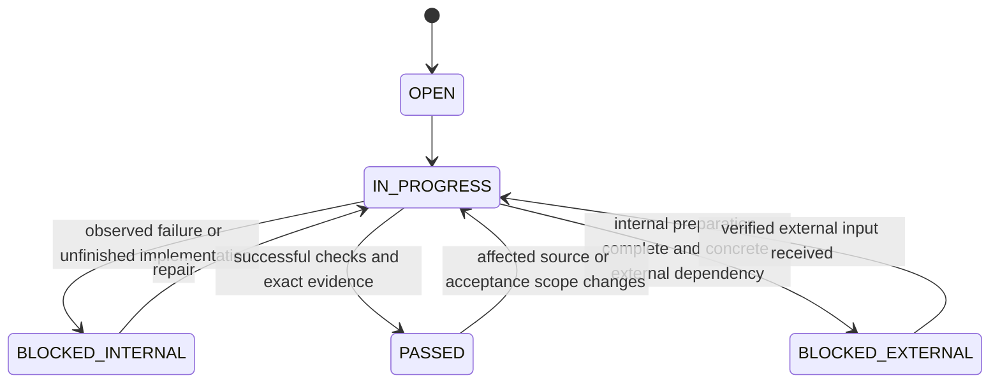

# Execution state and evidence

`AUTOPILOT_STATE.json` conforms to immutable schema 43.
`REQUIREMENTS_TRACEABILITY.json` conforms to schema 57 and is the editable
requirement ledger. The CSV is its deterministic projection; both preserve the
exact IDs, source references, summaries, priorities and platform scopes from 68.
`STAGE_REQUIREMENT_MAP.json` assigns implementation and validation milestones.

There are 41 stages, 342 requirements and 107 BIL requirements. Each mapped stage
has a criterion named `stageId.requirementId`; a global requirement remains open
until every applicable implementation and validation milestone is supported.
S00 has its historical baseline criterion. S01 has architecture and traceability
foundations; subsequent stages have an acceptance foundation in addition to
their mapped obligations. New foundation criteria require an explicit code and
test change; deleting a mandatory criterion in JSON cannot bypass acceptance.

## State transitions



The next pointer identifies the first remaining internal criterion in stage
order. A later stage may start early only with a documented parallel-safe
exception in `verificationCache.parallelSafeStages`; referenced evidence must
exist inside this repository. `COMPLETE` requires all stage criteria to pass.
`COMPLETE_WITH_EXTERNAL_BLOCKERS` preserves actual external dependencies and
requires all internal preparation to be complete. Missing code, tests, content
or translation is internal work. It must not become an owner task.

Accepted external note categories are credentials, signing, store_account,
legal, license, manual_review and owner_approval. Notes use
`external:category:concrete dependency`. Each external criterion still needs
the completed preparation, successful tests, evidence and a concrete owner
action; a category label alone cannot satisfy the evidence gate.

Nested bilingual/moderation readiness cannot bypass global acceptance.
Owner approval, actual submission and actual release require independent
evidence and authorization; current validators do not generate those facts.
The current execution permits local preparation and draft files only.

## Source and evidence identity

`baseSha` pins the adopted canonical main. `headSha` names the last accepted
atomic source/evidence commit, not the future commit containing the state file.
Both must be full Git SHAs and ancestors of the checkout. Criterion commits
identify the already committed implementation/checkpoint; a following commit
records its acceptance. This avoids an impossible self-referential commit hash.

Each acceptance manifest identifies exact criterion/requirement IDs, its source
commit, source-file identities, artifact identities and successful commands with
hashed logs. Both the SHA256 and Git blob identity must match that commit.
Git clean conversion respects CRLF and immutable-input `-text` attributes.
Absolute/traversal paths, escaping junctions, symlink files and nonregular Git
entries are rejected. A README or old command name by itself is not evidence.

Historical stage acceptance remains tied to its original source commit.
Later source edits or extraction moves are reported as historical staleness;
retained evidence artifacts must still match. Global PASSED requirements use
current input checks and must include all referenced implementation/test files
in the evidence identity. Changed inputs fail current acceptance. Relevant
dependency coverage must be supplied by each stage; this verifier does not
infer every behavioral dependency from a filename list.

The validator verifies recorded identities and results. It cannot manufacture
human/editorial/legal approval, prove that a forged log represents a real run,
or certify an unmeasured screen. Actual tool output, independent review and
later artifact/device gates remain necessary. Coverage fields are omitted in
S01; certification stays closed until the routed measurement gate is implemented.

## Commands

```sh
node scripts/mobile/verify-requirements.mjs
node scripts/mobile/stage-context.mjs S01
node scripts/mobile/verify-state.mjs
node scripts/mobile/platform-boundaries.mjs
node node_modules/vitest/vitest.mjs run scripts/mobile src/platform
```

The schema evaluator supports every keyword in pinned schemas 43 and 57 and
rejects unsupported keywords. It is not a general JSON Schema implementation.
Later routed schemas require explicit supported validation before acceptance.
`verify-state` checks the CSV projection, source pin, current-stage document
routing and evidence; a green result means the checkpoint is internally
consistent, not that V12 or any production locale is complete.
